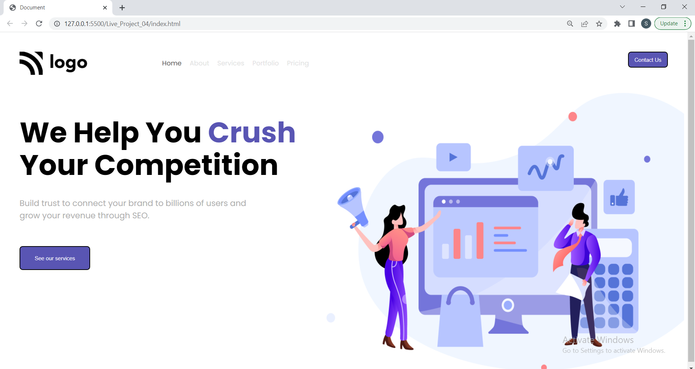

# Crush-Your-Competitors

This is basically a one pager portfolio Template project made in HTML/CSS for a SEO based Service on the internet.
Hope you like my project !! And as it is not responsive it works well in laptop screen and please zoom in in case of other device.


## Technologies Used
  - HTML
  - CSS
  

## Demo



## Run Locally

Clone the project

```bash
  git clone https://github.com/suhas-sm/Crush-your-competitors.git
```

Go to the project directory

```bash
  cd Crush-your-competitors
```
## Features

- UI/UX Design
- One Pager Website
- Use of pacing two divs side by side

## What i have learnt By working on this project
1. Got a good understanding on what are css units by my research like `em`, `rem`, `percentages`, `vh` and `vw` etc.

## Honest Time to finish the project

I had took about 30 min to 40 min approximately as only xoncentartion required was on font-size and font-weight.
## Feedback

If you have any feedback, please reach out to us at melmurissm11@gmail.com
